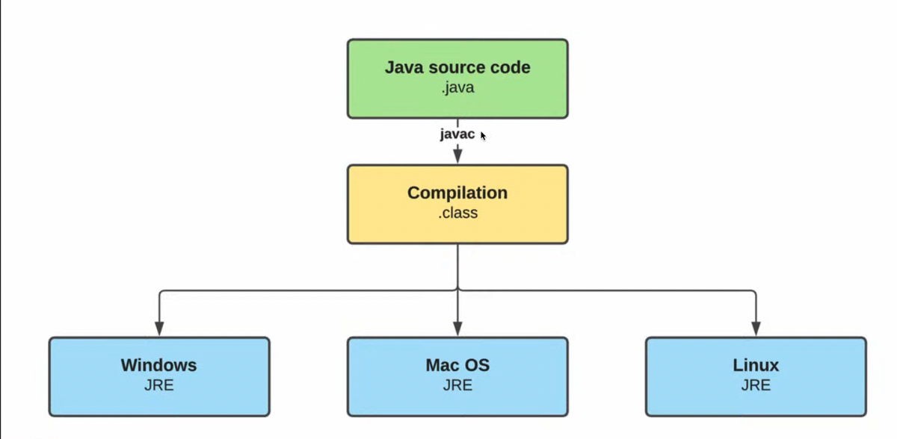
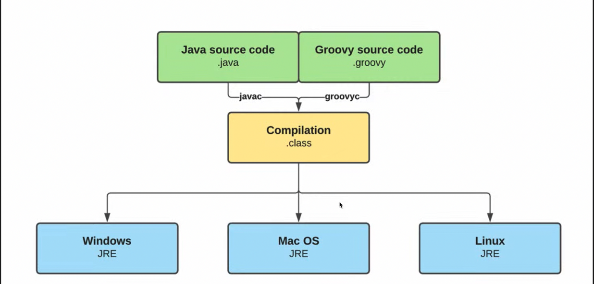

Groovy - это объектно ориентированный язык програмирования, разработанный для JRE как дополнение к Java. Т.е. он не был
    создан для замены Java.

    Groovy был представлен в 2003 году Джеймсом Стрэченом (James Strachan), который был вдохновлен таими языками как
        Python, Ruby, Smalltalk и он захотел все лучшее принести в Java. Java ен так быстро развивался, как другие языки
        ввиду поддержания обратной совместимости.
        Верчии Groovy:
        1 - Groovy 1.0 в 2007г.
        2 - Groovy 2.0 в 2012г.
        3 - Groovy 3.0 в 2020г.
        4 - Groovy 4.0 в 2022г.

    что представляет собой Groovy:
        1. Имеет java-подобный синтаксис;
        2. Компилируется в bytecode, поэтому может работать напрямую с другим java кодом;
        3. Может использоваться в любом Java проекте;
        4. Может использоваться как кросс-платформенный scripting language;
        5. Является как СТАТИЧЕСКИМ так и ДИНАМИЧЕСКИМ языком программирования.

    Динамический язык программирования - язык программирования, который во время выполнения (runtime) осуществляет
            множество вещей, которые статические языки программирования делают во время компиляции (compilation).
            Например:
            - синтаксический анализ кода
            - компиляция кода "на лету"
            - определение типов данных (optional т.к. в groovy мы можем использовать возможности как ститического языка,
                так и динамического, следовательно мы можем указывать, а можем и не указывать типы данных)
            - добавление нового кода в классы и объекты (т.е. мы в runtime можем добавить какой-то метод для выбранного
                объекта либо даже для целого класса)

    Как работает Java:
    Есть java source code .java который пишет программист -> вызываем javac - этап компиляции нашего java кода в байт-код
        который будет иметь расширение .class -> теперь на любой системе JRE сможет запустить наш код.

    В свою очередь groovy практически ничем не отличается от java:
    Его классы Groovy source code будут иметь расширение .groovy но это только бестПрактис называть такие классы .groovy
        а называться они могут как угодно -> и далее мы используем утилиту groovyc который преобразует исходный код в 
        байт-код.

    Где в основном используется Groovy:
    - Gradle
    - Jenkins
    - Grails - основной фреймворк, который используется для написания приложений на Groovy и он работает поверх SpringBoot
    - Spock Framework - невероятно гибкий и удобный фрейм для написания тестов