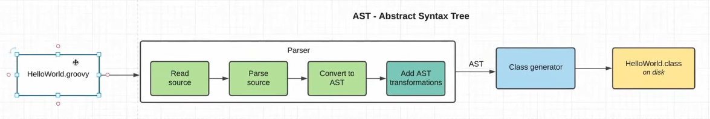
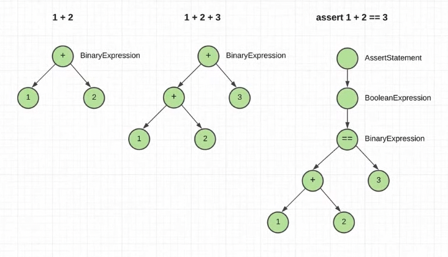

    AST transformations. Что бы понять, как это работает, нам нужно окунуться в то, как работает parser представленный
            на картинке в consoleStartGroovy.md

    1. Исходный код groovy передается в парсер;
    2. Парсер его считывает;
    3. Парсит;
    4. Конвертирует в AST (Abstract Syntax Tree)
    5. Далее передается в класс-генератор
    6. Получаем на выходе *.class - байткод

