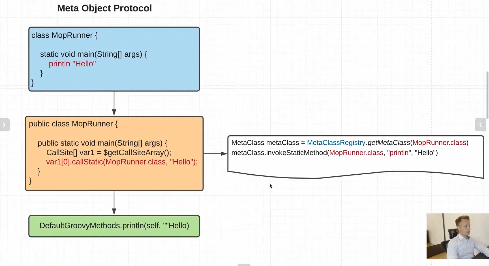
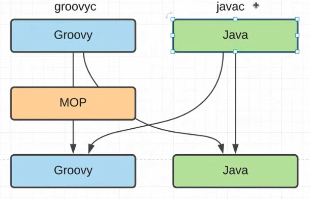

    Dynamic programming. Динамическое программирование позволяет добавлять новый функционал, поля или
                            изменять уже существующий во время выполнения (runtime)

    Meta - это информация об информации. Например мы описываем какую-то структуру данных еще чем-то.
    
    Поэтому в Groovy существует Meta Object Protocol (MOP), который добавляет нам динамическую составляющую в уже
        существующие классы. Например:
                Мы создадим некий MopRunner и запустим там println "Hello". Когда мы откроем байт код, мы увидим, что
            у нас появился какой-то CallSite[] у которого вызывает callStatic(). Промтыми словами говоря, вот эта прослойка
            CallSite и есть MOP. Это значит, что мы неявно вызываем методы через другие прослойки-классы. Мы никогда в 
            Groovy-классах не вызываем методы у тго класса, где мы его вызвали. Получается что все методы в Groovy 
            проксируются через MetaClass

    Все что вызвано через groovyc проходит через MOP. javac - нет

