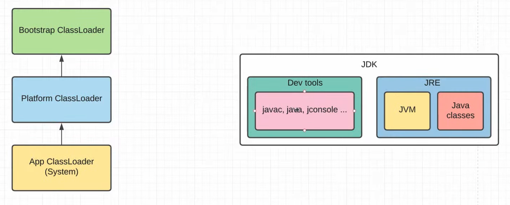
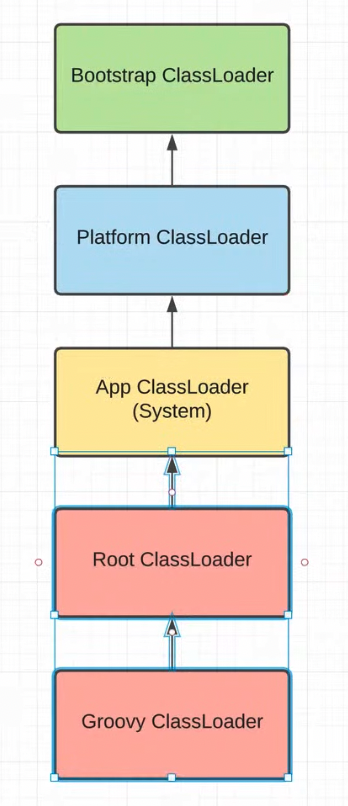

Как Java грузит свои классы:

    JDK состоит из:
        - Dev tools
            - java
            - javac
            - jconsole
            - ...
        - JRE
            - JVM
            - Java classes

    Так вот для загрузки наших классов нужны КлассЛоадеры. Их три:
        - Bootstrap ClassLoader - для загрузки критически важных классов в первую очередь. Он встроен в JVM и конечно 
            в нем и находится ClassLoader.class который грузит другие классы
        - Platform ClassLoader - загружает другие модули, которые не так критичны и загружает их во время требований, 
            т.е. Lazy. Так сделали, чтиобы ускорить старт java приложений: Bootstrap классы - сразу же загружаются в память
            Остальные классы - lazy, только по требованию
        - App ClassLoader (System) - грузит то, что мы написали сами.

    Нужно понимать, что загружается все сверху вниз. Значит когда мы загружаем класс, мы должны проверить у всех наших 
    parent. Сначала проверяется класс у Bootstrap ClassLoader и если там не нашлись классы, следовательно их загрузил
    скорее всего Platform ClassLoader, если и там не нашли, то пробуем искать в App ClassLoader и т.д.
    Можно даже написать свои classLoaders, как поступает например TomCat для того, что бы загружать наши классы из 
    папки webApp, где мы разворачиваем наши .war

    Окей, JVM знает, где находятся классы из JRE, а как знать где наши классы? вот именно для этого используется переменная
    classPath. AppClassLoader загружает все классы из -classpath.

Как Groovy грузит классы:

    
    Сначала мы ищем наши классы в GroovyClassLoader, и потом уже идем по схеме Java. И так работают ГрувиСкрипты.
    GroovyClassLoader - URLClassLoader принимает на вход URL[] urls - тот же classpath в виде переметра