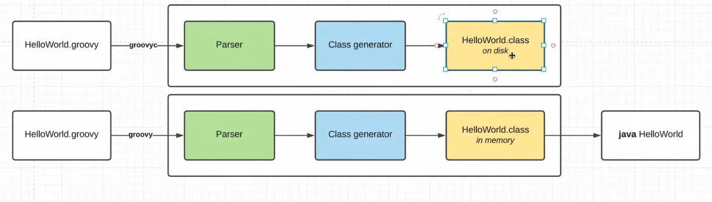

    .groovy мы можем запускать из консоли как и java. Переходим в скачанный пакет с groovy/bin/groovyc и передаем путь
    к .groovy файлу и получим скомпилированный файл .class. Тепереь можно запустить при помощи java.
    НО можно срезу скомпилировать и запустить: Переходим в скачанный пакет с groovy/bin/groovy и передаем путь к .groovy.
    Но в этом случае не появится скомпилированного .class файла.

    Вот почему:

    В первом случае .class сохранился на диск, во втором он загрузился в память